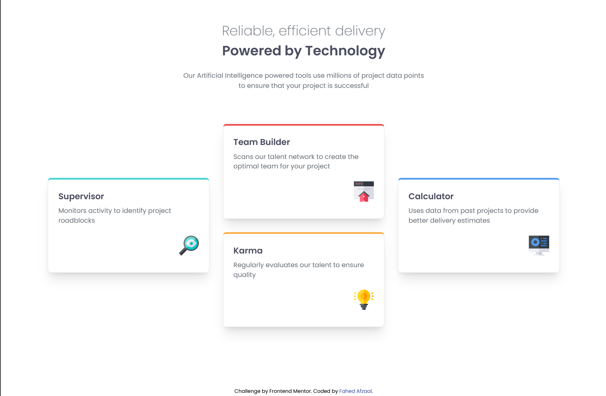

# Frontend Mentor - Four card feature section solution

This is a solution to the [Four card feature section challenge on Frontend Mentor](https://www.frontendmentor.io/challenges/four-card-feature-section-weK1eFYK). Frontend Mentor challenges help you improve your coding skills by building realistic projects. 

## Table of contents

- [Overview](#overview)
  - [The challenge](#the-challenge)
  - [Screenshot](#screenshot)
  - [Links](#links)
- [My process](#my-process)
  - [Built with](#built-with)
  - [What I learned](#what-i-learned)
  - [Continued development](#continued-development)
  - [Useful resources](#useful-resources)
- [Author](#author)

## Overview

### The challenge

Users should be able to:

- View the optimal layout for the site depending on their device's screen size

### Screenshot



### Links

- Solution URL: [GitHub Repository](https://github.com/Fahedafzaal/frontend/tree/main/day-4/card-feature-section)
- Live Site URL: [Netlify Deployment](https://day4card.netlify.app/)

## My process

### Built with

- Semantic HTML5 markup
- CSS custom properties
- Flexbox
- Mobile-first workflow
- [React](https://reactjs.org/) - JS library
- [TypeScript](https://www.typescriptlang.org/) - Type safety
- [Vite](https://vitejs.dev/) - Build tool
- [Tailwind CSS](https://tailwindcss.com/) - CSS framework

### What I learned

This project helped me strengthen my understanding of:

**React Component Architecture**
- Created reusable Card components with TypeScript interfaces
- Implemented proper prop typing for better development experience
- Used data-driven approach with centralized card data

**Tailwind CSS Layout**
- Responsive design with Tailwind's utility classes
- Implemented layouts using flexbox utilities
- Created responsive typography and spacing systems

**CSS**
- Text Clamp

```tsx
// Example of the Card component with TypeScript
export default function Card({
  title,
  description,
  icon,
  color,
}: {
  title: string;
  description: string;
  icon: string;
  color: string;
}) {
  return (
    <div className={`typography flex flex-col gap-2 flex-1 border max-w-sm border-gray-200 border-t-4 ${
      color === 'cyan' ? 'border-t-cyan' :
      color === 'red' ? 'border-t-red' :
      color === 'orange' ? 'border-t-orange' :
      color === 'blue' ? 'border-t-blue' : ''
    } shadow-xl rounded-lg p-6`}>
      <h3>{title}</h3>
      <p className="font-normal">{description}</p>
      
    </div>
  );
}
```

### Continued development

Areas I want to continue focusing on in future projects:

- **Advanced CSS Grid**: Explore more complex grid layouts and responsive patterns
- **Accessibility**: Improve ARIA labels and keyboard navigation
- **Testing**: Add unit tests and integration tests
- **Animation**: Add smooth transitions and micro-interactions

### Useful resources

- [Tailwind CSS Documentation](https://tailwindcss.com/docs) - Excellent reference for utility classes and responsive design
- [React TypeScript Cheatsheet](https://react-typescript-cheatsheet.netlify.app/) - Great resource for TypeScript with React patterns
- [Vite Documentation](https://vitejs.dev/guide/) - Helped me understand the build process and configuration
- [Frontend Mentor](https://www.frontendmentor.io/) - Amazing platform for practicing real-world projects

## Author

- Frontend Mentor - [@fahedafzaal](https://www.frontendmentor.io/profile/fahedafzaal)
- GitHub - [@fahedafzaal](https://github.com/fahedafzaal)
