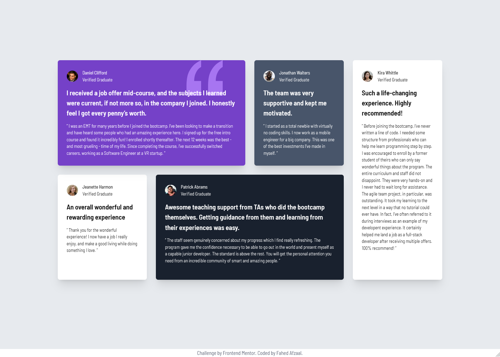

# Frontend Mentor - Testimonials grid section solution

This is a solution to the [Testimonials grid section challenge on Frontend Mentor](https://www.frontendmentor.io/challenges/testimonials-grid-section-Nnw6J7Un7). Frontend Mentor challenges help you improve your coding skills by building realistic projects. 

## Table of contents

- [Overview](#overview)
  - [The challenge](#the-challenge)
  - [Screenshot](#screenshot)
  - [Links](#links)
- [My process](#my-process)
  - [Built with](#built-with)
  - [What I learned](#what-i-learned)
  - [Continued development](#continued-development)
  - [Useful resources](#useful-resources)
- [Author](#author)

## Overview

### The challenge

Users should be able to:

- View the optimal layout for the site depending on their device's screen size

### Screenshot

### Links

- Solution URL: [Github Repository](https://github.com/Fahedafzaal/frontend/tree/main/day-5/testimonials-grid-section)
- Live Site URL: [Netlify Deployment](https://testimonials-grid-section-fahedafzaal.netlify.app/)

## My process

### Built with

- Semantic HTML5 markup
- CSS custom properties
- Flexbox
- CSS Grid
- Mobile-first workflow
- [React](https://reactjs.org/) - JS library
- [Vite](https://vitejs.dev/) - Build tool
- [Tailwind CSS](https://tailwindcss.com/) - CSS framework
- TypeScript

### What I learned

The main challenges in this project were:

1. **CSS Grid Layout with Order**: Using CSS Grid's `order` property to create the specific layout where cards appear in different positions on larger screens while maintaining a logical flow on mobile.

2. **Z-index Stacking Context**: Managing the SVG quotation pattern to appear behind the text content while staying above the card background. This required careful positioning and z-index management.

3. **Responsive Design**: Implementing a mobile-first approach that gracefully scales to desktop layouts using Tailwind's responsive utilities.

4. **Component Architecture**: Building reusable Card components that can accept children for additional content like the SVG pattern.

### Continued development

Areas I want to continue focusing on in future projects:

- Advanced CSS Grid techniques and complex layouts
- Better understanding of stacking contexts and z-index behavior
- Performance optimization for React components
- Accessibility improvements and semantic HTML structure

### Useful resources

- [CSS Grid Layout Module Level 1](https://www.w3.org/TR/css-grid-1/) - Official CSS Grid specification
- [Tailwind CSS Documentation](https://tailwindcss.com/docs) - Comprehensive guide to Tailwind utilities
- [MDN Web Docs - Z-index](https://developer.mozilla.org/en-US/docs/Web/CSS/z-index) - Understanding stacking contexts

## Author

- Frontend Mentor - [@fahedafzaal](https://www.frontendmentor.io/profile/fahedafzaal)
- GitHub - [@fahedafzaal](https://github.com/fahedafzaal)

