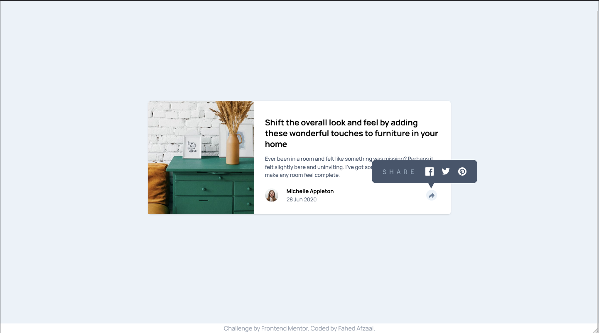

# Frontend Mentor - Article preview component solution

This is a solution to the [Article preview component challenge on Frontend Mentor](https://www.frontendmentor.io/challenges/article-preview-component-dYBN_pYFT). Frontend Mentor challenges help you improve your coding skills by building realistic projects. 

## Table of contents

- [Overview](#overview)
  - [The challenge](#the-challenge)
  - [Screenshot](#screenshot)
  - [Links](#links)
- [My process](#my-process)
  - [Built with](#built-with)
  - [What I learned](#what-i-learned)
  - [Continued development](#continued-development)
  - [Useful resources](#useful-resources)
- [Author](#author)

## Overview

### The challenge

Users should be able to:

- View the optimal layout for the component depending on their device's screen size
- See the social media share links when they click the share icon

### Screenshot



### Links

- Solution URL: [Github Repository](https://github.com/Fahedafzaal/frontend/tree/main/day-6/article-component)
- Live Site URL: [Netlify Deployment](https://your-live-site-url.com)

## My process

### Built with

- Semantic HTML5 markup
- CSS custom properties
- Flexbox
- CSS Grid
- Mobile-first workflow
- [React](https://reactjs.org/) - JS library
- [Vite](https://vitejs.dev/) - Build tool
- [Tailwind CSS](https://tailwindcss.com/) - CSS framework

### What I learned

This project helped me strengthen my understanding of several key concepts:

**React State Management**: I learned how to effectively manage component state using the `useState` hook to control the share menu visibility. The toggle functionality was crucial for the user experience.

```jsx
const [isShareOpen, setIsShareOpen] = useState(false);
const handleShareClick = () => {
  setIsShareOpen(!isShareOpen);
};
```

**Responsive Design with Tailwind CSS**: I implemented a mobile-first approach using Tailwind's responsive utilities. The component adapts seamlessly from mobile to desktop layouts.

```jsx
<div className="max-w-md bg-white rounded-lg shadow-sm md:max-w-4xl">
  <div className="md:flex">
    <div className="md:w-[35%]">
      
    </div>
  </div>
</div>
```

**Conditional Rendering**: I mastered conditional rendering to show different share menu layouts based on screen size and state.

```jsx
{(!isShareOpen || window.innerWidth >= 768) && (
  <div className="flex items-center gap-6 pt-6 md:pt-2">
    {/* Author section content */}
  </div>
)}
```

**CSS Custom Properties**: I learned to use CSS custom properties effectively with Tailwind's theme configuration for consistent color management.

```css
@theme {
  --color-primary: #48556a;
  --color-secondary: #6d7f97;
  --color-tertiary: #9eafc2;
  --color-quaternary: #ecf2f8;
}
```

### Continued development

Moving forward, I plan to focus on:

- **TypeScript Integration**: Adding type safety to my React components for better development experience
- **Advanced State Management**: Exploring more complex state management patterns for larger applications
- **Accessibility**: Improving keyboard navigation and screen reader support
- **Performance Optimization**: Learning about React.memo, useMemo, and useCallback for better performance
- **Testing**: Implementing unit and integration tests for my components

### Useful resources

- [Tailwind CSS Documentation](https://tailwindcss.com/docs) - Comprehensive guide for utility-first CSS framework
- [React Hooks Documentation](https://react.dev/reference/react/hooks) - Essential for understanding state management
- [Frontend Mentor Challenges](https://www.frontendmentor.io/) - Great platform for practicing real-world projects

## Author

- Frontend Mentor - [@fahedafzaal](https://www.frontendmentor.io/profile/fahedafzaal)
- GitHub - [@fahedafzaal](https://github.com/fahedafzaal)