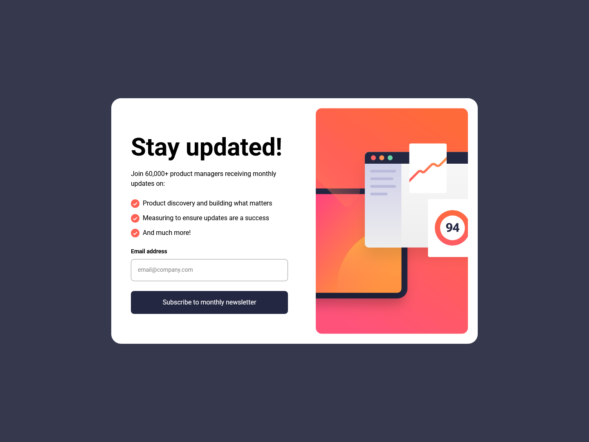

# Frontend Mentor - Newsletter sign-up form with success message solution

This is a solution to the [Newsletter sign-up form with success message challenge on Frontend Mentor](https://www.frontendmentor.io/challenges/newsletter-signup-form-with-success-message-3FC1AZbNrv). Frontend Mentor challenges help you improve your coding skills by building realistic projects. 

## Table of contents

- [Overview](#overview)
  - [The challenge](#the-challenge)
  - [Screenshot](#screenshot)
  - [Links](#links)
- [My process](#my-process)
  - [Built with](#built-with)
  - [What I learned](#what-i-learned)
  - [Continued development](#continued-development)
  - [Useful resources](#useful-resources)
- [Author](#author)

## Overview

### The challenge

Users should be able to:

- Add their email and submit the form
- See a success message with their email after successfully submitting the form
- See form validation messages if:
  - The field is left empty
  - The email address is not formatted correctly
- View the optimal layout for the interface depending on their device's screen size
- See hover and focus states for all interactive elements on the page

### Screenshot



### Links

- Solution URL: [Github](https://github.com/Fahedafzaal/frontend/tree/main/day-7/newsletter-form)
- Live Site URL: [Netlify](newsletter-form-fahedafzaal.netlify.app)

## My process

### Built with

- Semantic HTML5 markup
- CSS custom properties
- Flexbox
- CSS Grid
- Mobile-first workflow
- [React](https://reactjs.org/) - JS library
- [TypeScript](https://www.typescriptlang.org/) - Type safety
- [Vite](https://vitejs.dev/) - Build tool
- [Tailwind CSS](https://tailwindcss.com/) - CSS framework

### What I learned

This project helped me strengthen my understanding of several key concepts:

**React State Management**: I learned how to effectively manage multiple pieces of state (email, error, submission status) and coordinate them to create a smooth user experience.

```tsx
const [email, setEmail] = useState("");
const [error, setError] = useState("");
const [isSubmitted, setIsSubmitted] = useState(false);
```

**Form Validation**: Implemented client-side email validation using regex patterns and proper error handling:

```tsx
const handleSubmit = (e: React.FormEvent<HTMLFormElement>) => {
  e.preventDefault();
  const emailRegex = /^[^\s@]+@[^\s@]+\.[^\s@]+$/;
  if (!email || !emailRegex.test(email)) {
    setError("Valid email required");
    return;
  }
  setError("");
  setIsSubmitted(true);
};
```

**Responsive Design**: Used Tailwind CSS to create a mobile-first responsive design with proper breakpoints and conditional styling:

```tsx
<div className="flex flex-col items-center justify-center md:flex-row md:p-6 md:bg-white md:rounded-3xl md:max-w-4xl md:mx-auto">
```

### Useful resources

- [React Documentation](https://react.dev/) - Essential for understanding React hooks and state management
- [Tailwind CSS Documentation](https://tailwindcss.com/docs) - Comprehensive guide for utility-first CSS
- [TypeScript Handbook](https://www.typescriptlang.org/docs/) - Great resource for TypeScript best practices
- [Frontend Mentor](https://www.frontendmentor.io/) - Excellent platform for practicing real-world projects
- [MDN Web Docs](https://developer.mozilla.org/) - Reliable reference for HTML, CSS, and JavaScript

## Author

- Frontend Mentor - [@fahedafzaal](https://www.frontendmentor.io/profile/fahedafzaal)
- GitHub - [@fahedafzaal](https://github.com/fahedafzaal)
